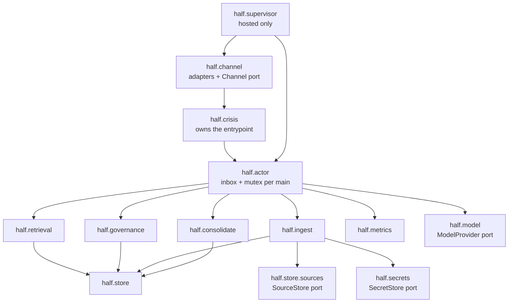
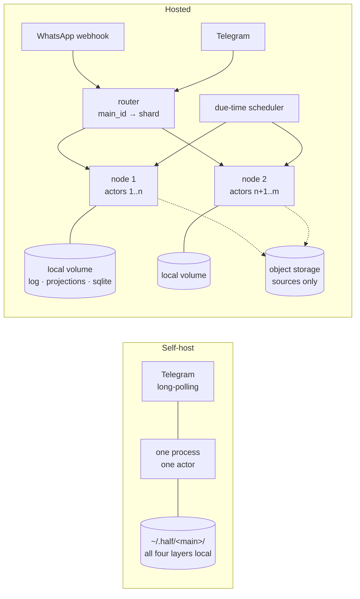
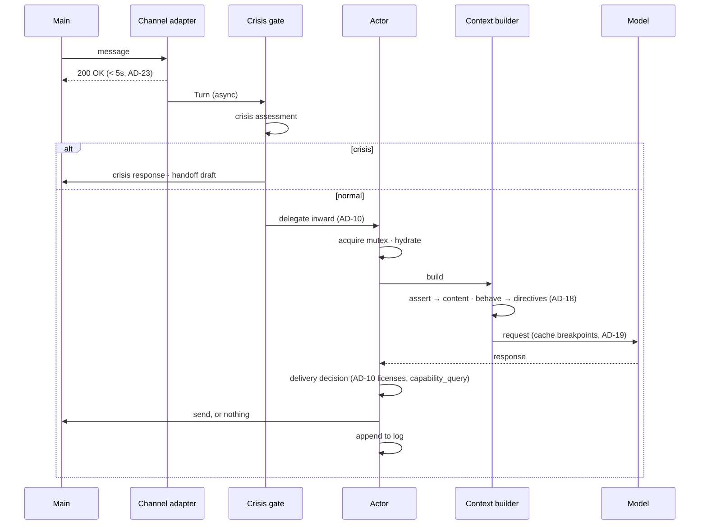

# Architecture Spine — Half v1

## Design Paradigm

**Event-sourced single-writer actor per main, hexagonal at the edges.**

An *actor* is an inbox plus a mutex keyed by `main_id` — not a process, not a task. It owns exactly one main's directory and serializes every mutation to it. Current state is a fold over an append-only log; derived stores are disposable.

The actor's core is a **local-first library over one directory**. The hosted product is a supervisor running many actors; self-hosting is one actor. Same code, never a stripped variant.

Ports (hexagonal) exist only where the outside world differs between those two deployments: `Channel`, `SourceStore`, `ModelProvider`, `SecretStore`.

| Layer | Namespace | Depends on |
| --- | --- | --- |
| Ports & adapters | `half.channel`, `half.model`, `half.secrets`, `half.store.sources` | domain types only |
| Entry gate | `half.crisis` | actor, channel, secrets |
| Actor runtime | `half.actor` | store, retrieval, governance, model, consolidate |
| Domain | `half.store`, `half.retrieval`, `half.governance`, `half.ingest`, `half.consolidate`, `half.metrics` | store, domain types |
| Supervision (hosted only) | `half.supervisor` | actor, channel |



No arrow may be reversed. `half.store` depends on nothing but domain types. `half.crisis` is depended upon by no domain module.

## Invariants & Rules

### AD-1 — Event-sourced single-writer actor per main `[ADOPTED]`

- **Binds:** all
- **Prevents:** two components writing one main's store concurrently; a hosted implementation diverging from the self-hosted one
- **Rule:** all mutation for a main serializes through that main's single owner. Hosted is a supervisor over many actors; self-host is one actor. Same code path.

### AD-2 — Python throughout `[ADOPTED]`

- **Binds:** all
- **Prevents:** a polyglot split between gateway and core; reimplementing solved surfaces
- **Rule:** Python 3.12+, asyncio. No agent-runtime dependency.

### AD-3 — Four storage layers, log is truth

- **Binds:** every unit that reads or writes state
- **Prevents:** two representations disagreeing about which is authoritative; an export that needs a serializer
- **Rule:** per main — `sources/` (content-addressed, immutable), `beliefs/YYYY-MM.jsonl` (append-only, **the only authority**), `loops/*.md` + `people/*.md` (markdown + YAML projections), and one SQLite file (materialized fold + FTS5 index). SQLite and every projection are derived and disposable.

### AD-4 — The replay invariant

- **Binds:** every unit that writes derived data
- **Prevents:** state accumulating only in a derived store — which would break export, expunge, and rebuild-after-model-churn at once
- **Rule:** deleting a main's SQLite file and replaying their log reproduces byte-identical state. Enforced as a CI test per commit, not as a convention.

### AD-5 — FTS5 BM25 is the hot retrieval path

- **Binds:** `half.retrieval`
- **Prevents:** a vector service creeping into the request path
- **Rule:** retrieval runs on SQLite FTS5 `bm25()` over the belief set. Any reranker or embedding model is optional and must degrade to correct results when absent.

### AD-6 — Own the gateway; port, don't adopt

- **Binds:** `half.channel`, `half.actor`
- **Prevents:** Half's control flow becoming a guest inside a host agent runtime
- **Rule:** no agent-runtime dependency. Real dependencies are official platform SDKs only. Modules ported from hermes-agent (MIT, © 2025 Nous Research) reproduce that notice.

### AD-7 — The Channel port has four operations

- **Binds:** every unit that emits to a main
- **Prevents:** platform time-window rules leaking upward as scattered special cases
- **Rule:** `receive`, `send`, `draft_link`, `capability_query`. `capability_query` answers *"may I send an unprompted message to this main right now?"* — WhatsApp's 24-hour window and Telegram's cannot-DM-first rule are answered here and nowhere else. The actor never knows which platform it is on. The port stays narrow.

### AD-8 — An actor is an inbox plus a mutex

- **Binds:** the runtime host
- **Prevents:** per-main process overhead making dormant users expensive; a second enforcement path for single-writer
- **Rule:** one worker process hosts many actors. A dormant actor is a dict entry; hydration opens SQLite and reads the fold snapshot. Hibernation is eviction from the LRU.

### AD-9 — Due-time queue for consolidation, never a global cron

- **Binds:** `half.consolidate`, the scheduler
- **Prevents:** a thundering herd — timezone spread does not save a user base that shares one timezone
- **Rule:** each main carries `next_pass_at` at their local pre-dawn with jitter; the scheduler drains what is due under bounded concurrency. Passes submit to the Batch API (~8pm local for a ~7am delivery, ~11h slack). A missed window sends nothing.

### AD-10 — Crisis owns the entrypoint and delegates inward

- **Binds:** every inbound path
- **Prevents:** a crisis check being refactored around, which a plain function call invites
- **Rule:** `half.crisis` owns the inbound entrypoint; the normal pipeline is something it calls and has no other caller. One call site, enforced by an architecture test. Python cannot structurally forbid a direct import — this is the strongest available guarantee, not a proof.

### AD-11 — The export boundary and the secret boundary must not overlap

- **Binds:** credential handling, export, replay
- **Prevents:** shipping a live OAuth refresh token inside the archive the main downloads; replay resurrecting a revoked credential
- **Rule:** per-main credentials live entirely outside the four layers — never in the log, a projection, replay, or export. Self-host uses OS keyring or an env-keyed encrypted file; hosted uses envelope encryption. Distinct from CAP-13, which governs secrets *found in sources*; this governs secrets Half was *given*.

### AD-12 — Same code, two deployment shapes; hosted is sharded and pinned

- **Binds:** infra, ops, `half.supervisor`
- **Prevents:** a hosted implementation diverging from self-host; an autoscaler moving an actor away from its disk
- **Rule:** self-host is one process, one actor, Telegram long-polling, all layers on local disk. Hosted is the same process type with many actors plus a router and scheduler, **sharded and pinned** — each node owns a set of mains, `main_id` maps to a shard, rebalancing is a deliberate drain-and-move. Per-main directories make actors sticky; object-storage-as-home is rejected because it turns an atomic `O_APPEND` under a single writer into a read-modify-write against an eventually-consistent store.

### AD-13 — SourceStore holds receipts, not bodies; layers 2–4 stay local

- **Binds:** `half.ingest`, rebuild
- **Prevents:** a message body Half could not fully scan being retained permanently in an immutable, content-addressed store
- **Rule:** **message bodies are never persisted.** A body is normalised, scanned, handed to its consumer, and discarded in memory. Layer 1 retains a *receipt* — digest, provenance metadata, and the record of what was redacted — every string of which is scrubbed. Log, projections, and SQLite stay local to the actor's node; the port survives for receipts and for any future artefact large enough to warrant object storage.
- **Cost, accepted deliberately:** rebuild can no longer re-derive claims from original text, so a better model cannot revisit old mail. Redaction is a denylist over a representation Half does not control — encodings, markup, and unknown shapes each defeat it — and every miss against an immutable store is permanent. Not retaining the body is the only version of CAP-13 that does not depend on having thought of every secret in advance.

### AD-14 — Backup is log-segment shipping

- **Binds:** the hosted operator
- **Prevents:** a backup strategy that re-uploads history, and a restore path that isn't the read path
- **Rule:** ship new log segments incrementally with `fsync` on append; point-in-time restore is replay to a timestamp. A node lost with unshipped segments loses the tail — the window shrinks, it does not close.

### AD-15 — Half is aware of its own absence

- **Binds:** the actor's wake path
- **Prevents:** Half resuming with a cheerful morning insight after a long outage as though nothing happened
- **Rule:** downtime is recorded in the main's own log. On wake after an outage exceeding a threshold, Half's first message accounts for its absence before anything else. Sharded-and-pinned means an outage removes a *named group of humans*, not a percentage of requests.

### AD-16 — Self-host is Telegram-first

- **Binds:** onboarding, packaging
- **Prevents:** promising a ninety-second self-host install that silently requires a domain and a tunnel
- **Rule:** self-host defaults to Telegram long-polling (works behind NAT). WhatsApp self-host requires a public host and is documented as such.

### AD-17 — One inbound path

- **Binds:** every unit on the inbound or outbound path
- **Prevents:** a second entrypoint; governance bolted on downstream of generation
- **Rule:** adapter receives → normalize to a `Turn` → crisis gate → actor inbox (mutex) → hydrate → build context → model call → delivery decision → channel send.

### AD-18 — Two-channel context

- **Binds:** `half.retrieval`, `half.governance`, the context builder
- **Prevents:** paying for tokens and then trusting a classifier to suppress them; *and* the opposite failure — filtering `behave` material out entirely, leaving Half either blunt or silent, unable to be gentle about what it may not name
- **Rule:** licenses are enforced at context-construction time, never by post-generation filtering. `assert`-licensed material enters context as **content** the model may state. `behave`-licensed material enters as **directives** — *"be gentle if travel comes up"* — transformed, never quoted. A `behave`-licensed belief's literal text must never appear in a constructed context; this is a test, not a guideline.

### AD-19 — One model port, one implementation, cache breakpoints exposed

- **Binds:** every model call
- **Prevents:** a permanent abstraction tax for a user who has not arrived; and a tidy interface that deletes the free tier
- **Rule:** one `ModelProvider` port with a single implementation; build the second when a self-hoster arrives with a non-Anthropic key. **Prompt cache breakpoints are first-class in the interface and never hidden** — the free-tier cost model rests on caching the stable prefix (system prompt, constitution, belief fold).

### AD-20 — Model tier is per-actor config

- **Binds:** `half.model`, actor config
- **Prevents:** a global tier that either overpays for free users or underserves paid ones
- **Rule:** cheap tier for free conversation and the batched nightly pass, higher tier for paid conversation. The tier travels with the main.

### AD-21 — Endorsement is sampled and asked in-register

- **Binds:** `half.metrics`, `half.governance`
- **Prevents:** collecting the north-star metric by spending the scarcest resource the product runs on
- **Rule:** sample roughly 5% of surfaced insights for the 30-day check, never all. Phrase it as the existing *Half asks for help* move, not as a survey. Asking costs trust; measuring must not degrade what it measures.

### AD-22 — Telemetry carries counts, never content

- **Binds:** every metric path
- **Prevents:** the most intimate dataset a person owns leaking through an observability side channel
- **Rule:** counts and timings only. Self-host defaults to **no telemetry at all** — off, not opt-out. Metrics compute locally into the main's own SQLite; a hosted operator aggregates numbers.

### AD-23 — Acknowledge the webhook, then process

- **Binds:** `half.channel`, the inbound path
- **Prevents:** Meta disabling the webhook after five consecutive failures
- **Rule:** WhatsApp Cloud API requires a 200 OK within 5 seconds. The inbound handler acknowledges immediately and enqueues to the actor asynchronously. A model call inside a webhook handler is forbidden.

### AD-24 — Retrieval weights, never excludes

- **Binds:** `half.retrieval`, `half.store`
- **Prevents:** a workspace, tenant, or topic partition appearing anywhere — the failure the spec names as disqualifying
- **Rule:** context changes retrieval *weight* only. Nothing in a main's store is ever unreachable to that main's Half. **Half must never be able to emit "I don't have access to that."** Any design that can produce that sentence is rejected, including a well-meaning per-topic scope filter.

### AD-25 — Half never sends to a third party

- **Binds:** `half.channel`, `half.governance`, `half.crisis`
- **Prevents:** an "on behalf of" send arriving as a convenience feature and turning Half into an agent that contacts people
- **Rule:** the only recipient Half sends to is its own main. Outbound to anyone else is produced as a prefilled draft via `Channel.draft_link` and dispatched by the main's own action. No code path sends to a non-main address. This holds in crisis, where it matters most.

### AD-26 — Volatile state never enters the log

- **Binds:** `half.store`, `half.ingest`, `half.consolidate`
- **Prevents:** "you've seemed down lately" produced from a bad Tuesday — mood promoted to durable belief
- **Rule:** state (how the main is right now) is volatile, overwritten, and expires; it is never written to the belief log and never survives a restart as belief. Beliefs **decay** in salience; loops **transition** state. They are separate pipelines and a loop is never run through belief refutation.

### AD-27 — Sending nothing is a first-class outcome

- **Binds:** `half.governance`, `half.actor`, `half.channel`
- **Prevents:** a delivery path where emitting a message is the only success case, which silently converts silence into an error to be handled away
- **Rule:** the delivery decision returns *send* or *stay silent*, and both are normal. Silence is not a failure, a timeout, or an exception. A day with nothing worth saying produces no message and no alert.

### AD-28 — A global license ceiling exists

- **Binds:** `half.governance`, `half.crisis`
- **Prevents:** aftercare being implemented as scattered per-feature suppression that a new feature forgets to honour
- **Rule:** the actor carries one ceiling that caps every belief and tension license regardless of their individual value. Crisis aftercare sets it to `behave` for the aftercare period; every emitting path reads it. Adding a new surface cannot bypass it, because the ceiling is applied where licenses are resolved, not where messages are composed.

### AD-29 — The op vocabulary is closed and versioned

- **Binds:** `half.store`, every module that appends
- **Prevents:** two modules inventing different op names for the same event, so that each one's replay silently skips the other's records while both pass AD-4 in isolation
- **Rule:** the set of log ops is enumerated in one module and carries a schema version. An unknown op encountered on replay is a hard error, never a skipped line. Adding an op is a deliberate versioned change.

### AD-30 — Replay is pure

- **Binds:** `half.store`, `half.consolidate`, every derivation
- **Prevents:** AD-4's byte-identical guarantee quietly becoming false the moment a main changes model tier — because a fold that re-derives will produce different output than the one that recorded
- **Rule:** the log records the **outcome** of every non-deterministic operation, never a promise to re-derive it. **Replay never calls a model, never touches the network, and never reads the clock.** A fold is a pure function of the log. This is what makes AD-4 true rather than aspirational.

### AD-31 — One renderer per projection

- **Binds:** `half.store.projections` and every module that changes projected state
- **Prevents:** two code paths rendering the same markdown file and drifting in format within a release, which AD-1's single writer does not catch because there is no concurrency
- **Rule:** exactly one renderer owns each projection type. No other module writes a projection file. Modules emit log records; the renderer folds them.

### AD-32 — Silence is a typed outcome

- **Binds:** `half.governance`, `half.metrics`, `half.channel`
- **Prevents:** one unit returning `None` for silence and another returning a reason, leaving the metrics and telemetry paths with nothing to count
- **Rule:** the delivery decision returns either a message or a `Silence` carrying its reason. The reason is required — AD-21 and AD-22 both consume it.

### AD-33 — Eviction never interrupts a turn

- **Binds:** `half.actor`
- **Prevents:** memory-pressure eviction dropping an in-flight response, or evicting between a model call and its log append and losing work already paid for
- **Rule:** eviction requires the mutex to be free. An actor with an in-flight turn is never evicted, and the log append that closes a turn happens before the mutex is released.

## Consistency Conventions

| Concern | Convention |
| --- | --- |
| Naming | `main_id` for the person, never `user_id`. Domain vocabulary follows `glossary.md` exactly — belief, loop, tension, license, main. Modules are `half.<area>`, singular. |
| Identity | `main_id` is an opaque ULID. Belief ids `b_<hex>`, tension ids `x_<hex>`, source ids `s_<hex>`, loop ids are kebab-case slugs. Ids are never reused. |
| Time | UTC ISO-8601 with `Z` on every stored timestamp; local time only for scheduling and display, always derived from the main's timezone. |
| Log records | One JSON object per line, UTF-8, no trailing whitespace. Every record carries `t`, `op`, `id`. Unknown fields are preserved verbatim on replay, never dropped. |
| Mutation | Only the owning actor writes. Every mutation is an append; nothing is edited in place. `retract` / `revise` / `expunge` are ops, not deletions — `expunge` tombstones. |
| Errors | Domain failures are typed exceptions in `half.errors`; adapters translate transport errors at the port boundary and never leak provider types inward. |
| Logging | Structured, no message content, no belief text, no main-identifying strings beyond `main_id`. |
| Config | Env vars for secrets and deployment shape; a per-main config record in SQLite for tier, timezone, and channel. No global mutable state. |
| Testing | The replay test (AD-4) and the two-channel context test (AD-18) are mandatory and run per commit. |

## Stack

| Name | Version |
| --- | --- |
| Python | 3.12+ |
| SQLite (stdlib `sqlite3`, FTS5 + `bm25()` verified present) | 3.51.0 |
| python-telegram-bot | 22.8 |
| WhatsApp Cloud API (Graph API) | v21.0 |
| Anthropic SDK (`anthropic`) | 1.2.0 |
| httpx | 0.28.1 |
| uv (developer tooling, not a runtime dependency) | — |

## Structural Seed





```text
half/
  channel/        # Channel port + telegram, whatsapp adapters
  crisis/         # owns the inbound entrypoint; delegates inward
  actor/          # inbox, mutex, LRU, hydration, lifecycle
  store/
    log.py        # append-only JSONL, the authority
    fold.py       # replay → SQLite materialized state
    projections/  # markdown + YAML renderers
    sources/      # SourceStore port: local fs | s3
  retrieval/      # strand weighting, FTS5 BM25, context builder
  governance/     # licenses, trust balance, unsaid + unasked queues, interrupt
  ingest/         # connectors, secret scrubbing, admission gates
  consolidate/    # nightly pass, tension minting, batch submission
  model/          # ModelProvider port; cache breakpoints first-class
  secrets/        # SecretStore port — outside the four layers (AD-11)
  metrics/        # local-only counts, sampled endorsement
  supervisor/     # hosted only: router, shards, due-time scheduler
```

## Capability → Architecture Map

| Capability | Lives in | Governed by |
| --- | --- | --- |
| CAP-1 conversational presence | `channel`, `actor`, `retrieval` | AD-7, AD-8, AD-17, AD-23 |
| CAP-2 onboarding demonstration | `ingest`, `retrieval`, `channel` | AD-13, AD-16, AD-19 |
| CAP-3 revealed-ledger ingestion | `ingest`, `store` | AD-3, AD-13 |
| CAP-4 stated-ledger acquisition | `governance`, `actor` | AD-18, AD-21 |
| CAP-5 belief ledger | `store` | AD-3, AD-4 |
| CAP-6 open-loop ledger | `store`, `retrieval` | AD-3, AD-4 |
| CAP-7 nightly consolidation | `consolidate` | AD-9, AD-20 |
| CAP-8 morning surface | `consolidate`, `governance`, `channel` | AD-7, AD-9, AD-15 |
| CAP-9 retrieval | `retrieval`, `store` | AD-5, AD-18 |
| CAP-10 delivery governance | `governance`, `retrieval` | AD-18, AD-7 |
| CAP-11 correction | `store` | AD-3, AD-4 |
| CAP-12 crisis protocol | `crisis` | AD-10, AD-17 |
| CAP-13 secret exclusion | `ingest` | AD-11 |
| CAP-14 export | `store` | AD-3, AD-4, AD-11 |

## Deferred

- **Multi-provider model support.** One port, one implementation until a self-hoster arrives with a non-Anthropic key (AD-19). The port makes it a day's work rather than a refactor.
- **Reranking and embeddings.** Optional by AD-5; not built in v1. Retrieval must be correct without them.
- **Shard rebalancing automation.** Drain-and-move is manual in v1; a live user base of the size that needs automation does not exist yet.
- **Variable response latency.** Argued as a product call (uniform sub-second response reads as nothing being behind it). Does not touch the spine; revisit at build time.
- **The first-party app, sensors, family plans, Half-to-Half.** Spec non-goals; the Channel port and the log format are the seams they would arrive through.
- **Packaging and distribution.** Python's weakest axis, accepted knowingly under AD-2; revisit if self-host adoption friction proves first-order.
- **Shard drain-and-move runbook.** A shard move must carry the main's secret store (AD-11) alongside their directory. An operational procedure, not a divergence between units.
- **Minors and mandatory-reporting jurisdictions.** Open in the spec; changes crisis obligations, not structure.
